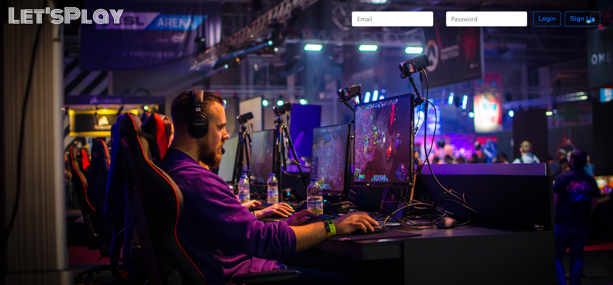

# Let's Play

 
# Overview
This full stack application allows gamers to find other people to game with based on social preferences, skill level, objectives, specific games, etc. Are you a competitive gamer looking to hone your skills or someone looking to casually learn a new game with chill people? Let's Play has you covered! 

It includes data persistence using MySQL, data retrieval via JawsDB, Front-end UI/UX using HTML/CSS and Handlebars, and finally utilizes an Express server built with Node.js.  

## Walkthrough
Our app starts with login page so each user can access their own friends, feed, etc.

Feel free to create a user account by clicking "Sign Up". We recommend using dummy information as we have yet to implement data encryption.

Once you have created an account take the gaming test to see what kind of gamer you are and be assigned a badge. You badge will tell other people what you prioritize while gaming.

<!-- ## Getting Started

1.  [Using Let's Play](#using-letsplay)
2.  [Database](#database)
3.  [Navigation](#navigation)
4.  [Next Steps](#next-steps)
5.  [Arichtecture](#architecture)
6.  [Credits and Collaborations](#credits-and-collaborations)

## Using Let's Play

To use Let's Play simply create a new user by clicking "Sign Up" on the landing page. We recommend using dummy information as we have yet to implement data encryption.

## Database

Enter database info here.

## Navigation

Enter navigation info here.

## Next Steps

Next, we would like to implement user authentication and storage that utilizes data encryption. -->

## Architecture

This application was deployed with the following technologies:

Node.js, JavaScript, Express, Heroku, HTML/CSS, and Handlebars.

## Credits and Collaborations

Collaborators: [Colin McPike](https://github.com/therealmcp) , [Derek Rutter](https://github.com/rutterer) , [Joshua Pearson](https://github.com/Pearsonj) , [Jared Yslas](https://github.com/YslasCo)

Speical thanks to the Full Stack Flex UW Coding Bootcamp instructional staff who assisted us with this project. 